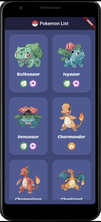

# Pokemon Challenge

Flutter app to list all the pokemons from the PokeApi and their details

#### Features

* Home Page with the list of all pokemons

[]

* Pokemon Detail Page with the information about a pokemon:
    * Experience
    * Weight
    * Height
    * Hp
    * Attack
    * Defense
    * Speed
    * A dropdown list with Moves
    
[]

#### TO-DO Features

* Screens for the pokemon detail:
    * Abilities
    * Forms
    * Game Indices
    * Items and Item Attributes

#### TESTS

It were executed Unit tests and Widget tests
* Unit Tests
    * Tested the mappers that convert json values to domain entities
* Widget Tests
    * Tested if there is an AppBar